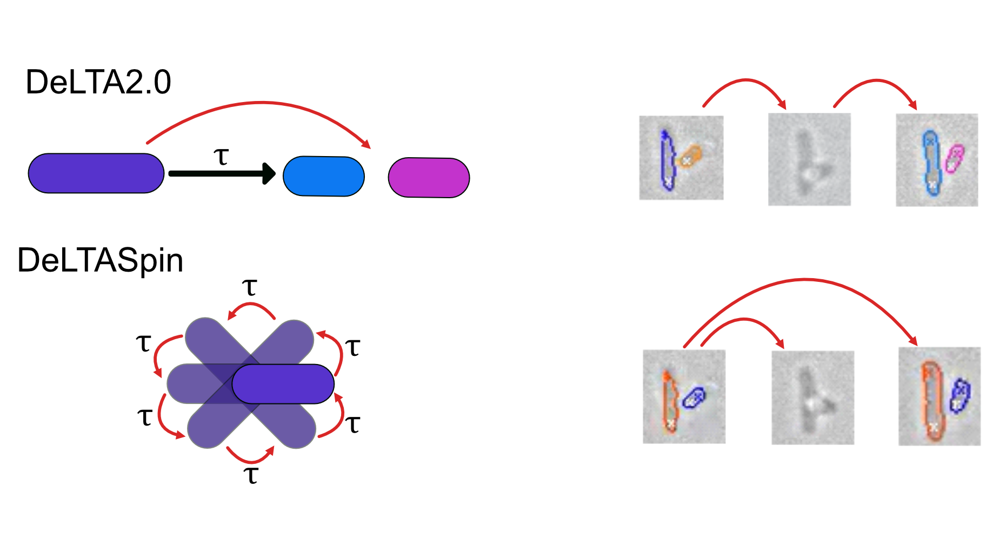

# DeLTASpin

DeLTASpin is a tool for automated analysis of tethered cell assay data, built on the DeLTA2.0 deep learning framework.

## Overview

While DeLTA2.0 was designed for analysing bacterial cells growing on a 2D surface or in mother-machine devices, DeLTASpin adapts the workflow for tethered cell assays, where cells remain attached to a surface and rotate rather than grow and divide.

Compared to DeLTA2.0, DeLTASpin:

- Assigns cell identity in each frame with respect to the first frame (rather than frame n-1), giving additional robustness when two cells overlap occasionally
- Disables division tracking, as tethered cell assay recordings typically span only a few minutes
- Includes classification of spinning cells and extracts motor speed and direction from pole coordinate data

The output is a .mat file that shows all cell lineages (as per DeLTA2.0) and additional .mat files for each spinner, containing motor speeds and the clockwise bias.

## Installation

DeLTASpin requires the DeLTA2.0 environment. Please follow the [DeLTA2.0 installation instructions](https://gitlab.com/delta-microscopy/delta) first. DeLTASpin was developed and tested against commit `cef6d9443ce5cc3a101cf940029d51c93f831ebf`.

Once the DeLTA2.0 environment is set up, replace the existing `utilities.py` and `pipeline.py` with the files found in the `DeLTASpin/` directory of this repo. The rest of the scripts are included for reference but remain unaltered compared to DeLTA2.0.

We also provide our training parameters for the segmentation U-net in `Training/unet_pads_seg.hdf5`. To use these, replace the existing `unet_pads_seg.hdf5` file with the one in this repo.

## Usage

To run the pipeline, run `delta_for_one.py` on your data. HPC scripts for running on a cluster (tested on the University of Edinburgh cluster with an Nvidia A100 GPU) are available under `Scripts/`.

## Reference

O'Connor OM, Alnahhas RN, Lugagne J-B, Dunlop MJ (2022) DeLTA 2.0: A deep learning pipeline for quantifying single-cell spatial and temporal dynamics. *PLoS Computational Biology* 18(1): e1009797. https://doi.org/10.1371/journal.pcbi.1009797

## Author

Diana Coroiu, University of Edinburgh  
Pilizota Lab
