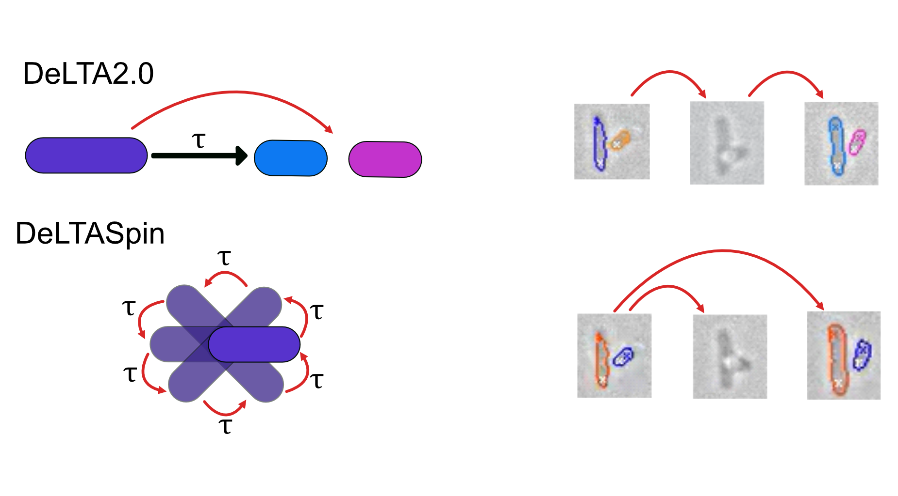

# DeLTASpin

DeLTASpin is a tool for automated analysis of tethered cell assay data, built on the DeLTA2.0 deep learning framework.

## Overview

While DeLTA2.0 was designed for analysing bacterial cells growing on a 2D surface or in mother-machine devices, DeLTASpin adapts the workflow for tethered cell assays, where cells remain attached to a surface and rotate rather than grow and divide.



Compared to DeLTA2.0, DeLTASpin:

- Assigns cell identity in each frame with respect to the first frame (rather than frame n-1), giving additional robustness in situations specific to rotation (e.g., when two cells overlap occasionally)
- Disables division tracking, as tethered cell assay recordings typically span only a few minutes
- Includes classification of spinning cells and extracts motor speed and direction from pole coordinate data

The output is a .mat file that shows all cell lineages (as per DeLTA2.0) and additional .mat files for each spinner, containing motor speeds and the clockwise bias.

## Installation

DeLTASpin requires the DeLTA2.0 environment. Please follow the [DeLTA2.0 installation instructions](https://gitlab.com/delta-microscopy/delta) first. Note that DeLTASpin was developed and tested against commit `cef6d9443ce5cc3a101cf940029d51c93f831ebf`.

Once the DeLTA2.0 environment is set up, replace the existing `utilities.py` and `pipeline.py` with the files found in the `DeLTASpin/` directory of this repo. The rest of the scripts are included for reference but remain unaltered compared to DeLTA2.0.

We also provide our trained weights for the segmentation U-net in `Training/unet_pads_seg.hdf5`. The `unet_pads_tracking.hdf5` weights are the same as for the original DeLTA2.0. 

## Usage

To run the pipeline, run `delta_for_one.py` on your data. HPC scripts for running on a cluster (tested on the University of Edinburgh cluster with an Nvidia A100 GPU) are available under `Scripts/`.


## Quick start

This section explains how to install DeLTASpin and test it on an example phase-contrast image sequence.

The quick-start materials include:

1. A Conda environment file containing the dependency versions used to develop and test DeLTASpin.
2. Modified DeLTA package files and the required model assets.
3. Example phase-contrast datasets, available from the GitHub Releases page.
4. Scripts for cropping an image sequence and running DeLTASpin on a smaller dataset when a GPU or HPC cluster is not available.

> These instructions are currently written for Windows.

### 1. Create the DeLTASpin environment

Make sure that Miniconda or Anaconda is installed. Then open **Anaconda Prompt** or **Miniconda Prompt** and navigate to the folder containing the environment file. For a standard Windows installation, this will usually be located at:

```text
C:\Users\<your_username>\miniconda3\envs\deltaspin\Lib\site-packages\delta
```

Create the environment with:

```bat
conda env create -f environment_windows.yml -n deltaspin
```

Activate it with:

```bat
conda activate deltaspin
```


### 2. Add the DeLTASpin files to the DeLTA installation

DeLTASpin uses modified versions of some files from the DeLTA package.

First, find the location of the `deltaspin` environment by running:

```bat
conda env list
```

This will show the path to the environment. For example:

```text
C:\Users\<your_username>\miniconda3\envs\deltaspin
```

Within this environment, navigate to the installed `delta` package.

Replace the original `pipeline.py` and `utilities.py` files with the modified versions provided in this repository.

Then copy the provided `assets` folder into the `delta` package directory.

### 3. Configure the paths to the trained weights files

Open the following file inside the installed `delta` package:

```text
config\config_2D.json
```

Update the segmentation and tracking model paths so that they point to the corresponding model files on your computer.

For example:

```json
{
    "model_file_seg": "C:/path_to_delta/assets/models/unet_pads_seg.hdf5",
    "model_file_track": "C:/path_to_delta/assets/models/unet_pads_track.hdf5"
}
```

### 4. Download the example datasets

Three example phase-contrast image sequences of tethered cells are available from the repository's **Releases** page. CheY** synthesis was induced at different levels in the three datasets.

All datasets were recorded at 100 frames per second.

Download the dataset you would like to analyse and extract the ZIP archive before continuing. DeLTASpin cannot analyse the images while they are still inside the archived folder.

The complete datasets are relatively large and may take several hours to analyse on a computer without a GPU. The next step therefore explains how to crop a smaller region of the field of view.

### 5. Crop an example dataset (optional)

To reduce the analysis time, use `crop_fov.py` to select a smaller region of the field of view, such as a single rotating cell or a small group of cells.

From the command line, run the following:

```bat
python crop_fov.py "<path_to_extracted_dataset>"
```

A window will open showing a looping preview of the image sequence.

1. Select the region of the field of view that you would like to analyse.
2. Confirm the selection.
3. Enter the number of frames that you would like to save.

The script will create a new folder containing the selected region for the requested number of frames. You can then run DeLTASpin on this smaller dataset.

### 6. Run DeLTASpin

With the `deltaspin` environment activated, navigate to the folder containing `delta_for_one.py`.

Run:

```bat
python delta_for_one.py "<path_to_dataset>" tif True 100
```

The arguments are:

- `<path_to_dataset>`: path to the folder containing the image sequence
- `tif`: image-file extension
- `True`: indicates that the images contain population-level data
- `100`: acquisition frame rate in frames per second

For example:

```bat
python delta_for_one.py "C:\Users\<your_username>\Desktop\cropped_dataset" tif True 100
```

The script will rename the images into the format expected by DeLTA, run segmentation and tracking, and then perform the DeLTASpin analysis.

## Reference

O'Connor OM, Alnahhas RN, Lugagne J-B, Dunlop MJ (2022) DeLTA 2.0: A deep learning pipeline for quantifying single-cell spatial and temporal dynamics. *PLoS Computational Biology* 18(1): e1009797. https://doi.org/10.1371/journal.pcbi.1009797

## Author

Diana Coroiu, University of Edinburgh  
Pilizota Lab
